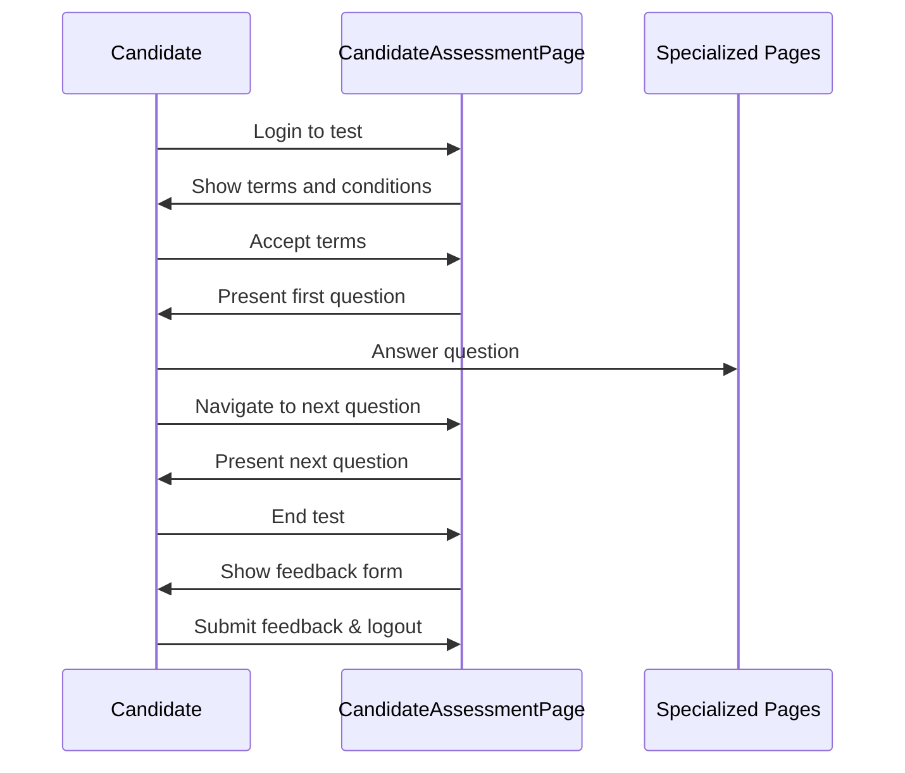

# Chapter 1: CandidateAssessmentPage

## Introduction

Have you ever taken an online test or assessment? Just like a tour guide helps travelers navigate through a new city, the `CandidateAssessmentPage` is your guide through the entire assessment experience. It's the central controller that manages everything from the moment you log in until you complete your test.

In this chapter, we'll learn how this important component works and how it orchestrates the entire assessment process.

## Why Do We Need a CandidateAssessmentPage?

Imagine you're taking an online coding assessment that includes multiple-choice questions, programming challenges, and SQL queries. Without a central controller:

- How would you move between different types of questions?
- How would you start or end the test?
- How would you handle permissions and warnings?

The `CandidateAssessmentPage` solves these problems by providing a unified interface that coordinates all these actions.

## Key Components of the CandidateAssessmentPage

Let's break down the main responsibilities of this component:

### 1. Test Lifecycle Management

The `CandidateAssessmentPage` handles the entire lifecycle of a test:
- **Before the test**: Login, terms acceptance, permissions
- **During the test**: Question navigation, answering questions
- **After the test**: Submission, feedback, logout

### 2. Coordination with Specialized Question Pages

Different question types require different interfaces. The `CandidateAssessmentPage` works with specialized pages for each question type:

```python
def __init__(self) -> None:
    self.selenium_apis = SeleniumDriverUtils()
    self.log = cl.customLogger()
    self.mcq_page = MCQPage()
    self.sql_page = SQLPage()
    self.programming_page = ProgrammingPage()
    # More specialized pages...
```

This code initializes connections to all the specialized pages that handle specific question types. It's like having expert guides for each attraction in your tour!

### 3. Navigation and Flow Control

The `CandidateAssessmentPage` helps candidates move through the test:

```python
def open_nth_question_in_problems_flyout(self, n: int) -> None:
    problem_list = self._get_problem_type_and_xpath_tuple_list_from_problems_flyout()
    self._open_question_from_flyout_with_xpath(problem_list[n - 1][1])
```

This method allows opening a specific question by its number. Think of it as turning to a specific page in a book.

## A Typical Assessment Journey

Let's walk through a typical assessment journey to understand how the `CandidateAssessmentPage` works:



## How to Use CandidateAssessmentPage

Let's look at some common operations:

### 1. Logging In to a Test

```python
def login(email, password):
    assessment_page = CandidateAssessmentPage()
    assessment_page.login_to_test_interface_tnc(email, password)
    assessment_page.enter_tnc_test_and_goto_problems_page()
```

This code logs into a test using the provided email and password, then handles the terms and conditions before proceeding to the test questions.

### 2. Navigating Between Questions

```python
def navigate_questions():
    assessment_page = CandidateAssessmentPage()
    # Open the first question
    assessment_page.open_first_question_in_problems_flyout()
    # Move to the next question
    assessment_page.click_on_next_question_button()
```

This example shows how to open the first question and then navigate to the next one.

### 3. Ending a Test

```python
def complete_test():
    assessment_page = CandidateAssessmentPage()
    # End the test
    assessment_page.end_test()
    # Submit feedback
    assessment_page.submit_feedback()
    # Logout
    assessment_page.logout_from_test()
```

This code demonstrates how to end a test, provide feedback, and log out from the assessment.

## Under the Hood: How CandidateAssessmentPage Works

The `CandidateAssessmentPage` class manages many interactions:

### Login and Test Preparation

```python
def login_to_test_interface_tnc(self, candidate_email: str, candidate_password: str):
    # Wait for login button to be visible
    self.selenium_apis.wait_till_element_visible(self.LOGIN_OR_SIGNUP_BUTTON, "css")
    self.selenium_apis.click_element(self.LOGIN_OR_SIGNUP_BUTTON, "css")
    # Enter credentials
    self.selenium_apis.element_send_keys(self.EMAIL_INPUT_FIELD, "css", candidate_email)
    self.selenium_apis.element_send_keys(self.PASSWORD_INPUT_FIELD, "css", candidate_password)
    # Click login
    self.selenium_apis.click_element(self.LOGIN_BUTTON, "css")
```

This method handles the login process by:
1. Finding the login button
2. Entering the candidate's email and password
3. Submitting the login form

### Question Management

The class keeps track of different question types and stores them for navigation:

```python
def _get_problem_type_and_xpath_tuple_list_from_problems_flyout(self) -> list[tuple[str, str]]:
    problems_details_list = self._extract_problem_details()
    # Converting the list to more manageable format
    converted_list = []
    for problem_detail_text in problems_details_list:
        # Extract question type and count
        # Add to the list
    return problem_type_and_xpath_tuple_list
```

This method extracts information about all questions in the test, which is then used for navigation.

### Handling Warnings and Permissions

```python
def accept_all_warnings_and_permissions(self):
    max_tries = 3
    is_any_warning_present_flag = False
    while max_tries > 0:
        # Check for different types of warnings and accept them
        max_tries -= 1
        if not is_any_warning_present_flag:
            break
```

This method handles any warnings or permission requests that may appear during the test, ensuring a smooth experience.

## Integration with Specialized Question Pages

The `CandidateAssessmentPage` doesn't work alone. It coordinates with specialized pages that handle specific question types. This relationship will be explored in more detail in the [QuestionsBase](02_questionsbase_.md) and [Specialized Question Pages](03_specialized_question_pages_.md) chapters.

```python
def submit_random_answer_for_questions_in_test(self):
    # Functions to attempt and submit each question type
    function_to_attempt_and_submit = {
        "programming": self.programming_page.enter_program_and_run_code,
        "multiple choice": self.mcq_page.submit_mcq_with_random_answer,
        "sql": self.sql_page.enter_sql_query_in_monaco_editor,
        # More question types...
    }
    
    # Attempt each question
    for problem_type, xpath in problem_type_and_xpath_tuple_list:
        function_to_attempt_and_submit[problem_type]()
```

This method shows how the main controller delegates question-specific behaviors to specialized pages.

## Conclusion

The `CandidateAssessmentPage` is the central controller that guides candidates through their assessment journey. It handles:

- The entire test lifecycle (login to logout)
- Navigation between different types of questions
- Coordination with specialized question pages
- User interactions and permissions

By centralizing these responsibilities, the `CandidateAssessmentPage` ensures a smooth and consistent experience for candidates, regardless of the question types in their assessment.

In the next chapter, [QuestionsBase](02_questionsbase_.md), we'll dive deeper into how different types of questions are structured and managed in the assessment system.

---

Generated by [AI Codebase Knowledge Builder](https://github.com/The-Pocket/Tutorial-Codebase-Knowledge)