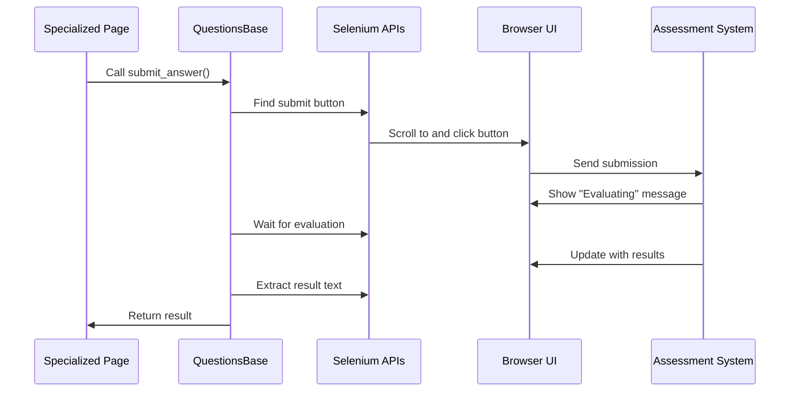

# Chapter 2: QuestionsBase

## Introduction

In [Chapter 1: CandidateAssessmentPage](01_candidateassessmentpage_.md), we learned about the central controller that manages the entire assessment experience. Now, let's dive into another essential component: `QuestionsBase`.

Imagine you're designing different types of vehicles - cars, trucks, and motorcycles. While they're all unique, they share common features like wheels, engines, and steering mechanisms. Instead of redesigning these common elements for each vehicle, you'd create a blueprint that all vehicles can inherit from.

This is exactly what `QuestionsBase` does in our assessment system. It's the common blueprint that all question types inherit from, providing shared functionality that every question needs.

## Why Do We Need QuestionsBase?

Consider what happens when you're taking an assessment with different question types:

- A multiple-choice question needs to submit your selected answer
- A programming question needs to let you write code and run it
- A SQL question needs to execute your query against a database

While these questions are different, they all need to:
- Submit answers
- Interact with text editors
- Display results
- Process submissions

Instead of duplicating this code for each question type, `QuestionsBase` provides these common functions that all question types can use.

## Key Components of QuestionsBase

Let's explore the main features that `QuestionsBase` provides:

### 1. Editor Interaction

One of the most important responsibilities of `QuestionsBase` is handling interactions with the Monaco code editor. This editor is used across different question types for entering code.

```python
def enter_text_in_monaco_editor(self, code_filename: str, dir_name: str = ""):
    file_path = self.selenium_apis.get_sample_code_path(code_filename)
    with open(file_path) as file:
        content = file.read()
    # Use JavaScript to insert the code into the editor
    self.selenium_apis.execute_javascript(
        "const models = monaco.editor.getModels();" +
        "models[0].setValue(arguments[0]);",
        content
    )
```

This method loads code from a file and inserts it into the Monaco editor. It works for any question type that uses a code editor!

### 2. Submission Handling

All questions need to be submitted for evaluation. `QuestionsBase` provides common methods for this:

```python
def click_submit_code_monaco_editor(self):
    self.selenium_apis.scroll_to_element(self.SUBMIT_CODE_BUTTON_BLUE)
    self.selenium_apis.click_element(self.SUBMIT_CODE_BUTTON_BLUE, "xpath")
    self.log.info("submitted...")
```

This method finds and clicks the submit button for code-based questions, handling all the details of scrolling and waiting for the element to be clickable.

### 3. Result Processing

After submitting an answer, candidates need to see the results. `QuestionsBase` handles the waiting and result extraction:

```python
def wait_till_submission_is_evaluated(self):
    try:
        # Wait for evaluation to start
        self.selenium_apis.wait_till_element_visible(self.SUBMISSION_EVALUATION_TEXT, "xpath", 5)
        # Then wait for it to finish
        self.selenium_apis.wait_till_element_invisible(self.SUBMISSION_EVALUATION_TEXT, "xpath", 200)
    except TimeoutException:
        self.log.warning("Submission evaluation text not found.")
```

This method handles the waiting period between submission and getting results, which applies to all question types.

### 4. Common UI Selectors

`QuestionsBase` defines selectors (XPath and CSS) for elements that appear across different question types:

```python
# These are class variables, not a method
RESULT_CONTAINER = ".result"
MONACO_TEXT_EDITOR_INPUT = "//textarea[contains(@class,'inputarea')]"
SUBMIT_BUTTON = "//input[@name='submit']"
LOAD_IDE_BUTTON = "//button[text()='Load IDE']"
```

These selectors help find important elements on the page regardless of the specific question type.

## A Practical Example: Using QuestionsBase

Let's see how `QuestionsBase` helps us solve a common task: entering and submitting code for evaluation.

The process typically involves:
1. Finding the code editor
2. Entering code into it
3. Submitting the code
4. Waiting for evaluation
5. Checking the results

Here's how `QuestionsBase` handles this workflow:

```python
def enter_text_in_monaco_editor_and_submit(self, code_filename: str = "Python.txt"):
    # Enter the code
    self.enter_text_in_monaco_editor(code_filename)
    # Submit the code
    self.click_submit_code_monaco_editor()
    # Open question list for navigation
    self.open_question_flyout()
```

This method combines multiple steps into one convenient function that any question type can use!

## How QuestionsBase Works: Under the Hood

When a specialized question page needs to submit an answer, here's what happens behind the scenes:



This flow remains consistent across different question types, which is why `QuestionsBase` is so valuable.

### Key Implementation Details

Let's look at a few important implementation details:

#### 1. Abstract Base Class

`QuestionsBase` isn't meant to be used directly. It's designed as a base class that other classes inherit from:

```python
def __init__(self) -> None:
    if type(self) is QuestionsBase:
        error_string = "QuestionsBase class is not meant to be used directly in tests"
        raise TypeError(error_string)
```

This code prevents direct instantiation of `QuestionsBase`, ensuring it's only used through specialized question pages.

#### 2. Smart Slug Handling

Different questions have unique identifiers (slugs). `QuestionsBase` extracts these automatically:

```python
def _get_current_problem_slug(self) -> str:
    current_url = self.selenium_apis.get_current_url()
    match_group = re.search(r"/problems/(.+)/", current_url)
    if match_group:
        return match_group.group(1)
    return ""
```

This method extracts the question slug from the URL, allowing for dynamic element targeting.

#### 3. Result Interpretation

When a submission is evaluated, the result needs to be interpreted. `QuestionsBase` handles this with pattern matching:

```python
def _get_submission_result_using_regex(self, response_text: str) -> str:
    patterns = ["passed", "accepted", "wrong answer", "runtime error"]
    for pattern in patterns:
        if pattern in response_text.lower():
            return pattern
    return ""
```

This method scans the response text for known patterns to determine the submission result.

## How Specialized Pages Use QuestionsBase

In the next chapter, [Specialized Question Pages](03_specialized_question_pages_.md), we'll see how different question types extend `QuestionsBase`. Here's a sneak peek:

```python
class ProgrammingPage(QuestionsBase):
    # Inherits all QuestionsBase methods and properties
    
    def run_code_with_custom_input(self, input_text):
        # Specialized method for programming questions
        self.enter_custom_input(input_text)
        self.click_run_button()
```

This `ProgrammingPage` class inherits all the functionality from `QuestionsBase` while adding its own specialized methods.

## Practical Example: Submitting a Programming Answer

Let's walk through a real-world example of submitting an answer to a programming question:

```python
# The CandidateAssessmentPage uses specialized pages
def submit_programming_answer(self):
    # Open the programming question
    self.open_nth_question_in_problems_flyout(2)
    
    # Use the programming page (which extends QuestionsBase)
    solution_file = "solution.py"
    self.programming_page.enter_text_in_monaco_editor_and_submit(solution_file)
    
    # Wait for evaluation and get results
    self.programming_page.wait_till_submission_is_evaluated()
    result = self.programming_page.get_submission_result()
    
    return result
```

In this example, `programming_page` is an instance of a specialized class that inherits from `QuestionsBase`. The specialized page gets all the common functionality from `QuestionsBase` while providing any programming-specific methods.

## Working with Different Editor Types

`QuestionsBase` also supports different editor types. Some questions use a rich text editor (Tox Editor) instead of Monaco:

```python
def enter_text_inside_tox_editor(self, text_to_enter: str, frame_index: int = 1):
    # Switch to the editor iframe
    xpath_for_tox_editor = self.TOX_EDITOR_IFRAME.replace("frame_index", str(frame_index))
    self.selenium_apis.switch_to_iframe(xpath_for_tox_editor)
    
    # Enter the text and exit the iframe
    self.selenium_apis.element_send_keys(self.TEXT_AREA_INSIDE_TOX_EDITOR_IFRAME, "css", text_to_enter)
    self.selenium_apis.exit_iframe()
```

This method handles the complexities of entering text in a rich text editor, providing a consistent interface regardless of the editor type.

## Conclusion

`QuestionsBase` is the foundation that all question types build upon. It provides:

- Common methods for editor interactions
- Submission handling and result processing
- Shared utilities for all question types
- A consistent interface for the assessment system

By centralizing these common functions, `QuestionsBase` ensures consistent behavior across different question types while reducing code duplication. It's like the DNA that all question types share, ensuring they work cohesively within the assessment system.

In the next chapter, [Specialized Question Pages](03_specialized_question_pages_.md), we'll explore how different question types extend `QuestionsBase` to provide specialized functionality while inheriting all the common behaviors we've discussed.

---

Generated by [AI Codebase Knowledge Builder](https://github.com/The-Pocket/Tutorial-Codebase-Knowledge)