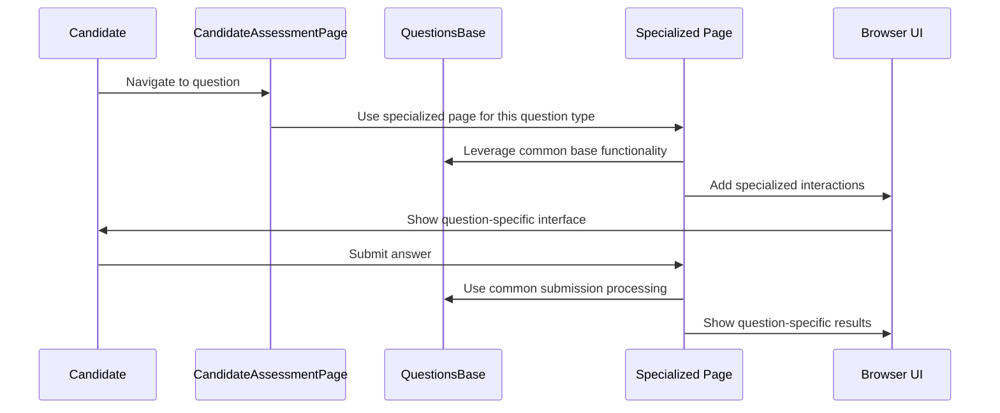
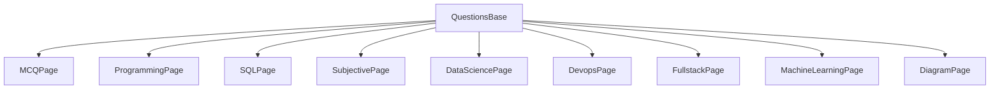

# Chapter 3: Specialized Question Pages

## Introduction

In [Chapter 2: QuestionsBase](02_questionsbase_.md), we learned about the common foundation that all question types build upon. Now, let's explore how this foundation is extended for different types of questions.

Imagine you're a chef with a basic set of cooking skills (chopping, measuring, heating). These core skills help you prepare many dishes, but different cuisines require specialized techniques. Making sushi demands different skills than baking a cake, even though both use your core cooking abilities.

Similarly, in our assessment system, different question types need specialized handling. This is where **Specialized Question Pages** come in - they're like expert chefs for each cuisine, building on the core skills while adding their own expertise.

## Understanding Specialized Question Pages

Specialized Question Pages are a family of classes that each handle a specific question type. Each inherits from [QuestionsBase](02_questionsbase_.md) but adds custom functionality for its unique question interface.

Let's look at the main types:

1. **MCQPage** - Handles multiple-choice questions
2. **ProgrammingPage** - Manages code-writing questions
3. **SQLPage** - Works with database query questions
4. **SubjectivePage** - Handles essay-type responses
5. **DataSciencePage** - Manages data analysis tasks
6. **DevopsPage** - Handles DevOps terminal interactions
7. **FullstackPage** - Works with full-stack development tasks
8. **MachineLearningPage** - Manages machine learning questions
9. **DiagramPage** - Handles diagram-drawing questions

Each specialized page knows exactly how to:
- Display its unique question interface
- Accept user input in the right format
- Submit answers correctly
- Interpret results specific to that question type

## How Specialized Question Pages Work

Let's take a closer look at how these specialized pages extend the base functionality:

### MCQ Page Example

The `MCQPage` handles multiple-choice questions. It inherits from `QuestionsBase` but adds methods specific to MCQs:

```python
class MCQPage(QuestionsBase):
    "This class contains all the functions related to MCQ questions"

    FIRST_MCQ_OPTION_IN_QUESTION = ".field-radio.objective-option"
    ANSWER_SAVED_CONFIRMATION = ".answer-saved"
    
    def submit_mcq_with_random_answer(self) -> None:
        first_option_mcq = self.selenium_apis.get_element(self.FIRST_MCQ_OPTION_IN_QUESTION, "css")
        first_option_mcq.click()
        self.selenium_apis.wait_till_element_visible(self.ANSWER_SAVED_CONFIRMATION, "css")
        self.log.info("mcq ans saved successfully...")
```

This method finds the first MCQ option, clicks it, and waits for the confirmation that the answer was saved. This is specific to how MCQ questions work, but it builds on the base functionality.

### Programming Page Example

The `ProgrammingPage` handles code-writing questions. It adds specialized methods for running code and testing against custom inputs:

```python
class ProgrammingPage(QuestionsBase):
    "This class contains all the functions related to Programming questions"
    
    def enter_custom_input(self, custom_input_text: str):
        self.selenium_apis.click_element(self.CUSTOM_INPUT_TAB, "xpath")
        self.selenium_apis.element_send_keys(self.CUSTOM_INPUT_TEXTAREA, "css", custom_input_text)
    
    def enter_program_and_run_code(self, code_filename: str = "Python.txt"):
        self.enter_text_in_monaco_editor(code_filename)
        self.click_save_and_run_code_button()
        self.open_question_flyout()
```

This code leverages the base `enter_text_in_monaco_editor` method from `QuestionsBase`, but adds programming-specific functionality like entering custom input and running the code.

## A Practical Example: Using Specialized Question Pages

Let's walk through how these specialized pages are used in a real assessment. Imagine a candidate is taking a test with different question types:

```python
def submit_answers_for_different_question_types():
    # Initialize the main assessment page
    assessment_page = CandidateAssessmentPage()
    
    # Open and answer an MCQ question
    assessment_page.open_nth_question_in_problems_flyout(1)
    assessment_page.mcq_page.submit_mcq_with_random_answer()
    
    # Open and answer a programming question
    assessment_page.open_nth_question_in_problems_flyout(2)
    assessment_page.programming_page.enter_program_and_run_code("solution.py")
    
    # Open and answer an SQL question
    assessment_page.open_nth_question_in_problems_flyout(3)
    assessment_page.sql_page.enter_sql_query_in_monaco_editor("SELECT * FROM users;")
    assessment_page.sql_page.results_of_execute_test_button_in_sql_submission()
```

In this example, the `CandidateAssessmentPage` navigates between questions, while the specialized page for each question type handles the specific interactions needed.

## How The Specialization Works: Behind the Scenes

When a candidate interacts with different question types, here's how the specialized pages work together:



This flow shows how the specialized pages build on the common base, adding their unique functionality while leveraging shared capabilities.

## Specialized Features: A Closer Look

Let's examine a few more specialized pages to see how they add unique functionality:

### SQLPage: Database Query Handling

The `SQLPage` adds specific methods for executing SQL queries and interpreting the results:

```python
class SQLPage(QuestionsBase):
    # Class-specific UI elements
    EXECUTE_TEST_BUTTON = "//button[normalize-space()='Execute & Test']"
    
    def enter_sql_query_in_monaco_editor(self, sql_query: str) -> None:
        # Wait for the editor to be ready
        self.selenium_apis.wait_till_element_visible(self.MONACO_TEXT_EDITOR_INPUT, "xpath")
        elem = self.selenium_apis.get_element(self.MONACO_TEXT_EDITOR_INPUT, "xpath")
        elem.send_keys(sql_query)
```

This specialized page knows how to handle SQL-specific actions like executing and testing queries, which wouldn't apply to other question types.

### DevopsPage: Terminal Interactions

The `DevopsPage` handles interactions with a terminal interface, which is completely different from other question types:

```python
class DevopsPage(QuestionsBase):
    DEVOPS_TERMINAL_IFRAME = "//iframe[@title='devops terminal']"
    ENTER_CODE = "//textarea[@class='xterm-helper-textarea']"
    
    def switch_to_devops_terminal_iframe(self):
        self.selenium_apis.switch_to_iframe(self.DEVOPS_TERMINAL_IFRAME, "xpath")
    
    def execute_command_in_terminal(self, command):
        self.selenium_apis.click_element(self.ENTER_CODE, "xpath")
        self.selenium_apis.element_send_keys(self.ENTER_CODE, "xpath", command)
```

This specialized page handles terminal-specific actions like switching to the terminal iframe and executing commands, which are unique to DevOps questions.

## The Inheritance Pattern: How It All Fits Together

The specialized question pages use an object-oriented pattern called inheritance. Think of it like a family tree:



This structure allows each specialized page to:
1. Inherit all the common functionality from `QuestionsBase`
2. Override methods when they need different behavior
3. Add new methods for functionality unique to that question type

## Using the Right Tool for the Job

The beauty of this design is that the [CandidateAssessmentPage](01_candidateassessmentpage_.md) doesn't need to know the details of each question type. It just needs to know which specialized page to use:

```python
def __init__(self) -> None:
    # Initialize all the specialized pages
    self.mcq_page = MCQPage()
    self.sql_page = SQLPage()
    self.programming_page = ProgrammingPage()
    self.subjective_page = SubjectivePage()
    # ... more specialized pages
```

Then, when handling a specific question, it delegates to the appropriate specialized page:

```python
def submit_random_answer_for_questions_in_test(self):
    # Map of question types to their specialized handlers
    function_to_attempt_and_submit = {
        "programming": self.programming_page.enter_program_and_run_code,
        "multiple choice": self.mcq_page.submit_mcq_with_random_answer,
        "sql": self.sql_page.enter_sql_query_in_monaco_editor,
        # More question types...
    }
    
    # Get the right function based on question type
    handler = function_to_attempt_and_submit[question_type]
    # Use the specialized handler
    handler()
```

This is like a master chef knowing which specialized chef to call for each type of cuisine - they don't need to know how to make sushi themselves, they just need to know who the sushi expert is.

## Conclusion

Specialized Question Pages are the expert guides for each type of challenge in the assessment system. They build on the common foundation provided by [QuestionsBase](02_questionsbase_.md) while adding their unique expertise for specific question types.

By using this approach:
- Common code is shared through inheritance
- Specialized behavior is isolated to the appropriate class
- New question types can be added by creating new specialized pages
- The main controller can easily work with any question type

This modular design makes the system easy to maintain and extend, while ensuring each question type gets the specialized handling it needs.

In the next chapter, [Test Lifecycle Management](04_test_lifecycle_management_.md), we'll explore how the assessment system manages the entire lifecycle of a test, from initialization to completion.

---

Generated by [AI Codebase Knowledge Builder](https://github.com/The-Pocket/Tutorial-Codebase-Knowledge)