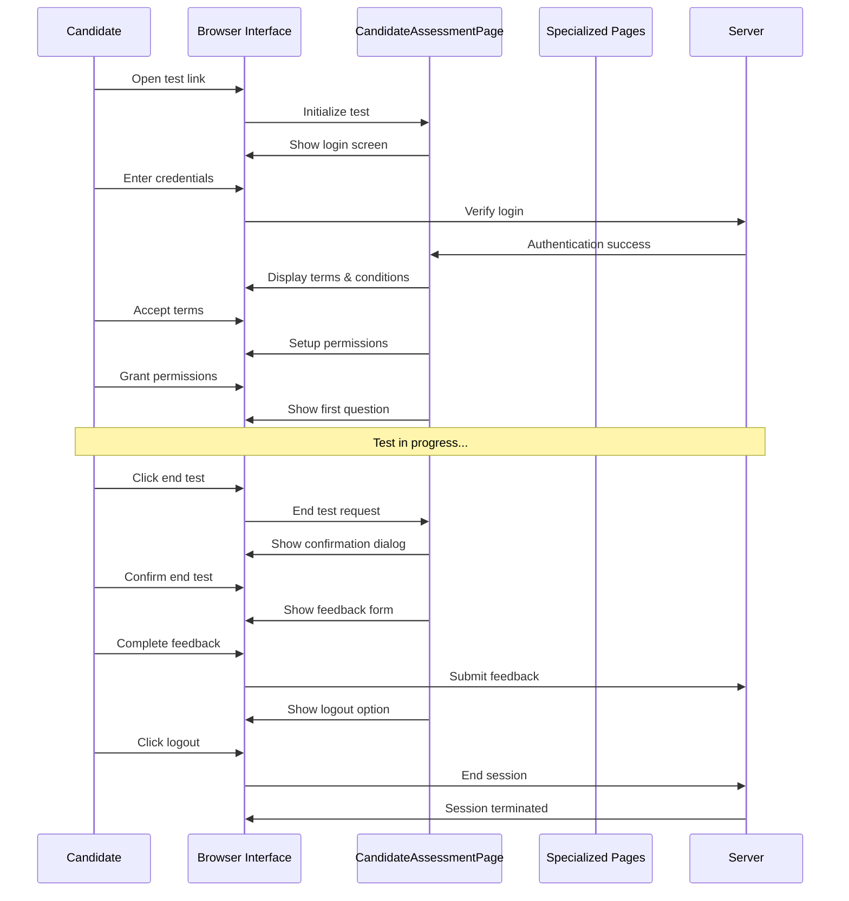

# Chapter 4: Test Lifecycle Management

## Introduction

In [Chapter 3: Specialized Question Pages](03_specialized_question_pages_.md), we learned how different question types are handled in our assessment system. But how does a test actually begin and end? What happens before you see the first question and after you answer the last one?

This is where **Test Lifecycle Management** comes in. Think of it like the opening and closing ceremonies of the Olympics - formal processes that officially start and end the event, ensuring everything proceeds correctly.

## Why Do We Need Test Lifecycle Management?

Imagine arriving at an exam without signing in, or leaving without submitting your answers. The test wouldn't be valid! In online assessments, we need structured processes to:

- Verify the candidate's identity (login)
- Ensure they understand the rules (terms and conditions)
- Properly start the assessment
- Collect feedback when they finish
- Securely end the session

Just like a flight needs proper takeoff and landing procedures, an assessment needs proper starting and ending procedures.

## Key Components of Test Lifecycle Management

Let's explore the main components of test lifecycle management:

### 1. Login and Authentication

Every assessment begins with verifying who you are:

```python
def login_to_test_interface_tnc(self, candidate_email: str, candidate_password: str):
    self.selenium_apis.click_element(self.LOGIN_OR_SIGNUP_BUTTON, "css")
    self.selenium_apis.element_send_keys(self.EMAIL_INPUT_FIELD, "css", candidate_email)
    self.selenium_apis.element_send_keys(self.PASSWORD_INPUT_FIELD, "css", candidate_password)
    self.selenium_apis.click_element(self.LOGIN_BUTTON, "css")
```

This code logs a candidate into the test system using their email and password. It's like checking your ID before entering an exam hall.

### 2. Terms and Conditions Acceptance

Before starting a test, candidates must agree to the rules:

```python
def enter_tnc_test_and_goto_problems_page(self):
    current_url = self.selenium_apis.get_current_url()
    if "/pre/tnc/" in current_url:
        self._click_accept_and_continue_tnc_buttons()
    # Navigate to problems page after accepting terms
    self.selenium_apis.go_to_url(
        self.selenium_apis.get_current_url().replace("pre/read-instructions/", "problems/"),
    )
```

This method checks if the candidate is on the terms and conditions page, accepts them if needed, and then navigates to the problems page. It's like signing a form acknowledging you understand the rules before an exam.

### 3. Handling Permissions and Warnings

Modern assessments may need browser permissions or display important warnings:

```python
def accept_all_warnings_and_permissions(self):
    max_tries = 3
    while max_tries > 0:
        # Check for different types of warnings and accept them
        self._click_allow_access_button_for_required_permissions_after_candidate_tnc()
        self._click_enable_fullscreen_button_in_modal_after_entering_test()
        max_tries -= 1
```

This code handles various permission requests and warnings that might appear during test setup. Think of it as going through a security checkpoint before entering a restricted area.

### 4. Ending the Test

When a candidate finishes their assessment, we need to properly close everything:

```python
def end_test(self):
    self.selenium_apis.click_element(self.END_TEST_BUTTON, "xpath")
    self.selenium_apis.wait_till_element_visible(self.END_CONFORMATION_BUTTON, "xpath")
    self.selenium_apis.click_element(self.END_CONFORMATION_BUTTON, "xpath")
    # Wait for finish message
    self.selenium_apis.wait_till_element_visible(".finish-test-message", "css")
```

This method safely ends the test by clicking the end button and confirming the action. It's like properly signing out of an exam and handing in your answer sheet.

### 5. Feedback Collection

After the test, we often want to collect the candidate's thoughts:

```python
def submit_feedback(self):
    # Rate clarity with 4 stars
    self.selenium_apis.click_element(self.FOUR_STARS_FOR_CLARITY_FEEDBACK_INPUT, "xpath")
    # Rate test interface with 3 stars
    self.selenium_apis.click_element(self.THREE_STARS_TEST_INTERFACE_FEEDBACK_INPUT, "xpath")
    # Add comments
    self.selenium_apis.element_send_keys(self.ADDITIONAL_COMMENTS, "xpath", "nice")
```

This code fills out a feedback form rating different aspects of the test experience. It's like filling out a survey after attending an event.

### 6. Secure Logout

Finally, we need to properly end the session:

```python
def logout_from_test(self):
    self.selenium_apis.wait_till_element_visible(self.LOGOUT_BUTTON_IN_FEEDBACK_PAGE, "xpath")
    self.selenium_apis.click_element(self.LOGOUT_BUTTON_IN_FEEDBACK_PAGE, "xpath")
```

This method logs the candidate out after completing the test and feedback. It's like ensuring the door is locked when you leave a secure area.

## A Complete Test Lifecycle Example

Let's walk through a practical example of a complete test lifecycle:

```python
def take_complete_test(email, password):
    assessment_page = CandidateAssessmentPage()
    
    # 1. Start the test
    assessment_page.login_to_test_interface_tnc(email, password)
    assessment_page.enter_tnc_test_and_goto_problems_page()
    assessment_page.accept_all_warnings_and_permissions()
    
    # 2. Answer questions (simplified)
    assessment_page.submit_random_answer_for_questions_in_test()
    
    # 3. End the test
    assessment_page.end_test()
    assessment_page.submit_feedback()
    assessment_page.logout_from_test()
```

This code shows a complete test journey from login to logout. It's like a checklist for a complete exam process - sign in, take the test, sign out.

## Under The Hood: How Test Lifecycle Management Works

Let's visualize what happens during a test lifecycle:



This diagram shows the flow of information between the candidate, the user interface, the CandidateAssessmentPage, and the server during a test lifecycle.

### Behind the Scenes: Starting a Test

When a candidate starts a test, several steps happen behind the scenes:

```python
def _click_accept_and_continue_tnc_buttons(self) -> None:
    # Wait for the accept button to be clickable
    self.selenium_apis.wait_till_element_clickable(self.ACCEPT_AND_CONTINUE, "xpath")
    # Click the button
    self.selenium_apis.click_element(self.ACCEPT_AND_CONTINUE, "xpath")
    
    # Handle additional privacy notices if present
    if len(self.selenium_apis.get_element_list(".tnc-container .left-nav button", "css")) == 2:
        self.selenium_apis.wait_till_element_clickable(self.ACCEPT_AND_CONTINUE, "xpath")
        self.selenium_apis.click_element(self.ACCEPT_AND_CONTINUE, "xpath")
    
    # Wait for the submit button and click it
    self.selenium_apis.wait_till_element_clickable(self.SUBMIT_AND_PROCEED_BUTTON, "xpath")
    self.selenium_apis.click_element_js(self.SUBMIT_AND_PROCEED_BUTTON)
```

This method handles the complex process of accepting terms and conditions, which may include multiple steps and different types of notices. It's like going through several pages of a legal document and initialing each one.

### Behind the Scenes: Handling Warnings

The system needs to handle various warnings and permission requests:

```python
def _accept_warning_if_its_present_from_xpath(self, xpath_for_warning: str, warning_name: str = "") -> bool:
    # Check if the warning is visible
    if not self.selenium_apis.is_element_displayed(locator=xpath_for_warning, locator_type="xpath"):
        self.log.info(f"{warning_name} button not present")
        return False
    
    # Try to click it if it's clickable
    if self.selenium_apis.is_element_clickable(locator=xpath_for_warning, locator_type="xpath"):
        self.selenium_apis.click_element(locator=xpath_for_warning, locator_type="xpath")
        self.log.info(f"clicking {warning_name} button")
        return True
    return False
```

This helper method checks if a specific warning is present and clickable, then handles it appropriately. It's like a security guard checking for different types of alerts and responding to each one correctly.

## Common Test Lifecycle Challenges

Using test lifecycle management helps solve several common challenges:

### 1. Multiple Login Attempts

Sometimes candidates might be logged in elsewhere:

```python
def check_if_user_already_logged_another_machine_or_browser(self):
    if "stonewall" in pytest.driver.current_url:
        self.selenium_apis.click_element(self.ORANGE_BUTTON_WHEN_STONEWALL, "css")
        # Wait for URL to change
        wait = WebDriverWait(pytest.driver, 10)
        wait.until(lambda driver: "stonewall" not in driver.current_url)
```

This code checks if the candidate is already logged in on another device (indicated by "stonewall" in the URL) and handles it. It's like detecting if someone has already signed in with your ID and resolving the conflict.

### 2. Handling Unanswered Questions

When ending a test, we might want to check for unanswered questions:

```python
def get_unanswered_questions_count_by_type(self, question_type: str):
    question_type_full_name = self.MAPPPING_UNANSWERED_QUESTION_TYPES_FROM_END_TEST_MODAL.get(question_type.lower())
    unanswered_questions = self.selenium_apis.get_element_list(self.UNANSWERED_QUESTIONS, "xpath")
    # Process the list to count unanswered questions of the specified type
    # ... implementation details ...
```

This method counts unanswered questions by type, which can be useful for warning candidates before they submit. It's like checking if you've filled in all sections of an exam before handing it in.

## Practical Tips for Test Lifecycle Management

Here are some practical tips for using test lifecycle management effectively:

### 1. Always Use Complete Lifecycle Methods

Instead of handling login, terms acceptance, and permissions separately, use the combined method:

```python
def setup_test(email, password):
    assessment_page = CandidateAssessmentPage()
    assessment_page.login_to_test_interface_tnc(email, password)
    assessment_page.enter_tnc_test_and_goto_problems_page()
    assessment_page.accept_all_warnings_and_permissions()
    return assessment_page
```

This approach ensures nothing is missed in the setup process. It's like using a pre-flight checklist instead of trying to remember each step manually.

### 2. Handle Special Cases for Different Environments

Different testing environments might have different requirements:

```python
def enter_test_with_environment_handling(email, password, is_secure_env=False):
    assessment_page = CandidateAssessmentPage()
    assessment_page.login_to_test_interface_tnc(email, password)
    
    # Special handling for secure environments
    if is_secure_env:
        # Additional security steps
        pass
        
    assessment_page.enter_tnc_test_and_goto_problems_page()
    return assessment_page
```

This pattern allows for adapting the process to different environments. It's like having different security protocols for different types of facilities.

## Conclusion

Test Lifecycle Management ensures that every assessment follows a proper protocol from start to finish. Like the opening and closing ceremonies of an event, it provides structure and formality to the testing process.

By handling login, terms acceptance, permissions, test completion, feedback, and logout, it creates a consistent and secure experience for candidates. This allows the specialized question pages we learned about in [Chapter 3](03_specialized_question_pages_.md) to focus solely on their specific question types, while the test lifecycle management handles the overall flow.

In the next chapter, [Test Navigation and Flow](05_test_navigation_and_flow_.md), we'll explore how candidates move between different questions and sections during an assessment. We'll see how navigation complements the lifecycle management we've learned about here, creating a seamless overall experience.

---

Generated by [AI Codebase Knowledge Builder](https://github.com/The-Pocket/Tutorial-Codebase-Knowledge)