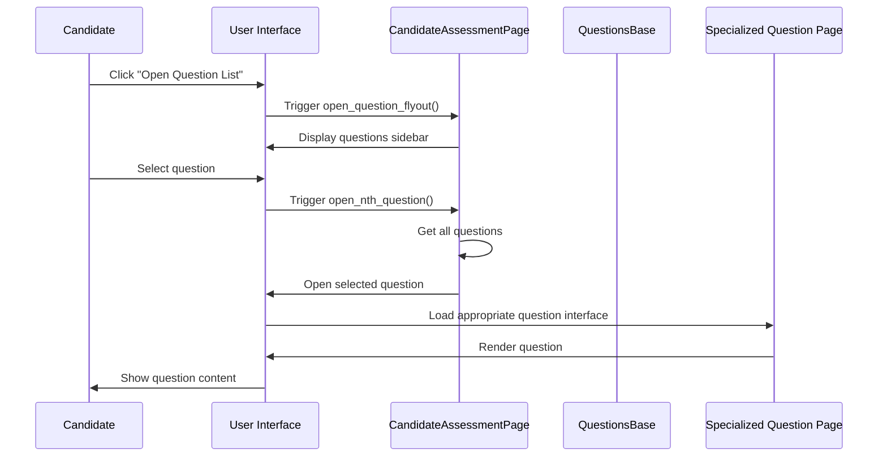

# Chapter 5: Test Navigation and Flow

## Introduction

In [Chapter 4: Test Lifecycle Management](04_test_lifecycle_management_.md), we learned how tests begin and end. But what happens in between? How do candidates move from one question to another? This is where **Test Navigation and Flow** comes into play.

Think of Test Navigation and Flow as the map and compass for your assessment journey. Just like how a GPS helps you navigate from one destination to another, this system helps candidates move between questions smoothly and keeps track of their progress throughout the test.

## Why Do We Need Test Navigation and Flow?

Imagine taking a test with 10 different questions. You might want to:
- Skip a difficult question and come back to it later
- Review answers you've already provided
- See which questions you haven't attempted yet
- Jump directly to a specific question

Without proper navigation, you might get lost in the test, unable to find your way back to questions you've skipped or unsure of which questions remain unanswered.

## Key Components of Test Navigation and Flow

Let's explore the main components that make navigation possible:

### 1. The Question Flyout

The Question Flyout is like a table of contents for your test. It's a sidebar that shows all questions and lets you jump directly to any question.

```python
def open_question_flyout(self):
    self.selenium_apis.click_element_js(self.BUTTON_TO_EXPAND_ALL_QUESTION_LEFT_NAV, "xpath")
```

This method opens the flyout sidebar that contains all the questions in the test. It's like opening a map to see all possible destinations.

### 2. Question Selection

Once the flyout is open, you can select any question to work on:

```python
def open_nth_question_in_problems_flyout(self, n: int) -> None:
    problem_list = self._get_problem_type_and_xpath_tuple_list_from_problems_flyout()
    self._open_question_from_flyout_with_xpath(problem_list[n - 1][1])
```

This method opens a specific question by its number. Think of it like choosing which page to turn to in a book.

### 3. Sequential Navigation

Sometimes you want to move forward or backward one question at a time:

```python
def click_on_next_question_button(self):
    self.selenium_apis.click_element(self.NEXT_QUESTION_BUTTON_OF_OPENED_QUESTION, "xpath")
```

This function clicks the "Next Question" button, allowing candidates to move forward through the test sequentially. It's like turning to the next page in a book.

### 4. Progress Tracking

The system keeps track of which questions you've answered and which ones remain:

```python
def get_unanswered_questions_count_by_type(self, question_type: str):
    # Get count of unanswered questions of a specific type
    unanswered_questions = self.selenium_apis.get_element_list(self.UNANSWERED_QUESTIONS, "xpath")
    # Process and return count
```

This method counts how many questions of a specific type remain unanswered. It's like checking a to-do list to see what tasks remain.

## A Practical Example: Navigating Through a Test

Let's walk through a practical example of navigating through a test with different question types:

```python
def navigate_through_test():
    assessment_page = CandidateAssessmentPage()
    
    # Open the first question
    assessment_page.open_first_question_in_problems_flyout()
    
    # Answer the question (simplified)
    # ...
    
    # Move to the next question
    assessment_page.click_on_next_question_button()
    
    # Jump to the fifth question
    assessment_page.open_nth_question_in_problems_flyout(5)
```

This code shows how to navigate through a test: starting with the first question, moving to the next one, and then jumping directly to the fifth question.

## How Navigation and Flow Work: Behind the Scenes

When a candidate navigates through a test, several things happen behind the scenes:



This diagram shows what happens when a candidate opens the question list and selects a specific question. The system coordinates between different components to ensure the right question is displayed with the correct interface.

### Question Listing: The First Step

The first step in navigation is getting a list of all questions:

```python
def _get_problem_type_and_xpath_tuple_list_from_problems_flyout(self) -> list[tuple[str, str]]:
    problems_details_list = self._extract_problem_details()
    # Converting to a list of (type, xpath) tuples
    problem_type_and_xpath_tuple_list = []
    # Process and return the list
    return problem_type_and_xpath_tuple_list
```

This method gets information about all questions in the test, including their types and how to find them on the page. It's like creating an inventory of all the destinations you can visit.

### Opening a Specific Question

Once we have the list, we can open any question:

```python
def _open_question_from_flyout_with_xpath(self, xpath_for_index_problem_statement: str) -> None:
    self.selenium_apis.wait_till_element_visible(xpath_for_index_problem_statement, "xpath")
    self.selenium_apis.click_element(xpath_for_index_problem_statement, "xpath")
```

This method finds and clicks on a specific question in the flyout. It's like selecting a destination on your map and going there.

## Types of Navigation Methods

The system provides several ways to navigate, catering to different needs:

### 1. Direct Access by Number

```python
def open_nth_question_in_problems_flyout(self, n: int) -> None:
    problem_list = self._get_problem_type_and_xpath_tuple_list_from_problems_flyout()
    self._open_question_from_flyout_with_xpath(problem_list[n - 1][1])
```

This allows jumping directly to any question by its number, which is useful for targeted review.

### 2. Starting at the Beginning

```python
def open_first_question_in_problems_flyout(self) -> None:
    problem_list = self._get_problem_type_and_xpath_tuple_list_from_problems_flyout()
    self._open_question_from_flyout_with_xpath(problem_list[0][1])
```

This opens the first question in the test, which is useful when starting the test or restarting from the beginning.

### 3. Sequential Navigation

```python
def click_on_next_question_button(self):
    self.selenium_apis.click_element(self.NEXT_QUESTION_BUTTON_OF_OPENED_QUESTION, "xpath")
```

This moves to the next question in sequence, which provides a natural flow for completing the test from start to finish.

## Practical Tips for Test Navigation

Here are some practical tips for effectively using the test navigation system:

### 1. Use the Question Flyout for Quick Access

When you need to jump between different parts of the test, use the question flyout:

```python
def review_specific_questions(questions_to_review):
    assessment_page = CandidateAssessmentPage()
    
    for question_number in questions_to_review:
        # Open the flyout if not already open
        assessment_page.open_question_flyout()
        # Jump to the specific question
        assessment_page.open_nth_question_in_problems_flyout(question_number)
        # Review the question
        # ...
```

This pattern allows efficient review of specific questions without going through every question sequentially.

### 2. Check Your Progress Regularly

Use the unanswered questions count to monitor your progress:

```python
def check_remaining_work():
    assessment_page = CandidateAssessmentPage()
    
    # Check how many multiple-choice questions remain
    mcq_remaining = assessment_page.get_unanswered_questions_count_by_type("o")
    # Check how many programming questions remain
    prog_remaining = assessment_page.get_unanswered_questions_count_by_type("p")
    
    print(f"MCQs remaining: {mcq_remaining}")
    print(f"Programming questions remaining: {prog_remaining}")
```

This helps ensure you don't miss any questions before completing the test.

### 3. Use Sequential Navigation for Initial Attempt

When taking the test for the first time, sequential navigation provides a structured approach:

```python
def take_test_sequentially():
    assessment_page = CandidateAssessmentPage()
    
    # Start with the first question
    assessment_page.open_first_question_in_problems_flyout()
    
    # After answering each question, move to the next one
    assessment_page.click_on_next_question_button()
    # Answer question 2
    
    assessment_page.click_on_next_question_button()
    # Answer question 3
    
    # And so on...
```

This ensures you see every question in a logical order, like reading a book from start to finish.

## Understanding Question Types During Navigation

The navigation system also helps identify different question types, which is crucial because each type requires different handling:

```python
def identify_question_types():
    assessment_page = CandidateAssessmentPage()
    problem_list = assessment_page._get_problem_type_and_xpath_tuple_list_from_problems_flyout()
    
    for question_type, xpath in problem_list:
        print(f"Found question of type: {question_type}")
        # Different handling based on type
        if question_type == "programming":
            # Handle programming question
            pass
        elif question_type == "multiple choice":
            # Handle MCQ
            pass
```

This allows the system to provide the right interface and tools for each question type, ensuring a smooth experience as you navigate between different types of questions.

## A Complete Navigation Flow Example

Let's put it all together with a complete example of navigating through a test:

```python
def complete_test_navigation():
    assessment_page = CandidateAssessmentPage()
    
    # 1. Start with the first question
    assessment_page.open_first_question_in_problems_flyout()
    
    # 2. Answer it (simplified)
    # ...
    
    # 3. Move to next question
    assessment_page.click_on_next_question_button()
    
    # 4. Skip a difficult question by going to question #4
    assessment_page.open_nth_question_in_problems_flyout(4)
    
    # 5. Later, come back to the skipped question (#3)
    assessment_page.open_nth_question_in_problems_flyout(3)
    
    # 6. Check how many questions remain unanswered
    remaining = assessment_page.get_unanswered_questions_count_by_type("o")
```

This example demonstrates a typical navigation flow: starting at the beginning, moving sequentially, skipping a difficult question, coming back to it later, and checking progress.

## Conclusion

Test Navigation and Flow is the map and compass that guides candidates through their assessment journey. It provides multiple ways to move between questions, keeps track of progress, and ensures a smooth experience regardless of question type.

By understanding how navigation works, you can efficiently move through a test, prioritize questions, and ensure you don't miss anything important. The system's flexibility allows for both sequential progression and targeted access, adapting to your preferred test-taking strategy.

In the next chapter, [Monaco Editor Interaction](06_monaco_editor_interaction_.md), we'll explore how candidates interact with the code editor for programming questions, building on the navigation foundation we've established here.

---

Generated by [AI Codebase Knowledge Builder](https://github.com/The-Pocket/Tutorial-Codebase-Knowledge)