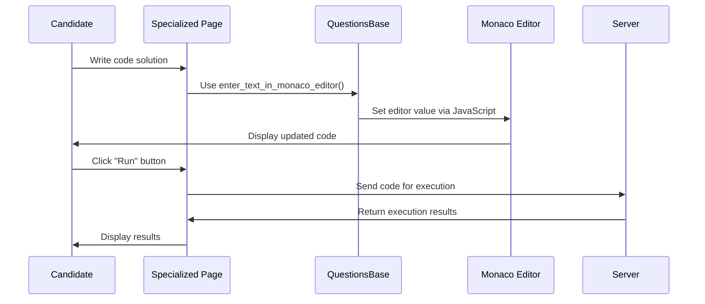

# Chapter 6: Monaco Editor Interaction

## Introduction

In [Chapter 5: Test Navigation and Flow](05_test_navigation_and_flow_.md), we learned how candidates move between different questions in an assessment. Now, let's explore how candidates actually interact with the code editor to solve programming challenges.

Think of the **Monaco Editor** as a specialized notepad designed specifically for writing code. If you've ever used modern code editors like Visual Studio Code, the Monaco Editor will feel familiar - because it's actually the same editor technology that powers VS Code!

When you encounter a programming question during an assessment, the Monaco Editor is where you'll write your solution. But how do you interact with it effectively? That's what this chapter is all about.

## Why Do We Need Monaco Editor Interaction?

Imagine you're taking an assessment that includes a programming challenge: "Write a function that returns the sum of two numbers." You need to:

1. Write your code in the correct programming language
2. Test it with different inputs
3. Submit it for evaluation

Without proper tools to interact with the editor, these tasks would be difficult. Monaco Editor Interaction provides methods that make these tasks simple and intuitive.

## Key Components of Monaco Editor Interaction

Let's explore the main components that allow us to interact with the Monaco Editor:

### 1. Entering Code in the Editor

The most basic interaction is entering code into the editor:

```python
def enter_text_in_monaco_editor(self, code_filename: str, dir_name: str = ""):
    file_path = self.selenium_apis.get_sample_code_path(code_filename)
    with open(file_path) as file:
        content = file.read()
    self.selenium_apis.execute_javascript(
        "const models = monaco.editor.getModels();" +
        "models[0].setValue(arguments[0]);",
        content
    )
```

This method reads code from a file and inserts it into the Monaco Editor. It's like copying and pasting code, but done automatically. The JavaScript part modifies the editor's content directly.

### 2. Selecting a Programming Language

Different questions might require different programming languages. The editor lets you select the language you want to use:

```python
def select_language_in_monaco_editor(self, language: str):
    self.selenium_apis.click_element(self.LANGUAGE_SELECTION_DROPDOWN, "xpath")
    self.selenium_apis.handle_drop_down(language, self.LANGUAGE_SELECTION_DROPDOWN, "xpath")
    # Verify selection was successful
    selected_language = self.selenium_apis.get_currently_selected_item_in_drop_down(
        self.LANGUAGE_SELECTION_DROPDOWN, "xpath"
    )
```

This code selects a programming language from the dropdown menu. It's like telling the editor "I want to write Python code" or "I want to write Java code", so it can provide appropriate syntax highlighting and error checking.

### 3. Working with Custom Input

When testing your code, you often want to try it with different inputs:

```python
def enter_custom_input(self, custom_input_text: str):
    self.selenium_apis.click_element(self.CUSTOM_INPUT_TAB, "xpath")
    self.selenium_apis.element_send_keys(
        self.CUSTOM_INPUT_TEXTAREA, "css", custom_input_text
    )
```

This method allows you to enter custom test data for your code. It's like saying "Let's see if my code works correctly when I give it this specific input."

### 4. Resetting Code Stubs

Sometimes you want to start fresh or return to the original template code:

```python
def reset_code_stubs_in_monaco_editor(self):
    self.selenium_apis.click_element(self.RESET_CODE_STUBS_ICON, "xpath")
    self.selenium_apis.click_element(self.RESET_CODE_STUBS_BUTTON_INSIDE_MODAL, "xpath")
```

This function resets the editor content back to the initial template. It's like using an eraser to clean your notepad and start over.

## A Practical Example: Solving a Programming Challenge

Let's walk through a practical example of using the Monaco Editor to solve a programming question:

```python
def solve_programming_question():
    # Initialize the programming page
    programming_page = ProgrammingPage()
    
    # Select Python as our language
    programming_page.select_language_in_monaco_editor("PYTHON3")
    
    # Enter our solution code
    code = "def sum_two_numbers(a, b):\n    return a + b"
    programming_page.enter_text_in_monaco_editor("solution.py")
    
    # Test with custom input
    programming_page.enter_custom_input("5 7")
    programming_page.click_save_and_run_code_button()
    
    # If our solution works, submit it
    programming_page.click_submit_code_monaco_editor()
```

This example shows a complete workflow: selecting a language, entering code, testing it with custom input, and submitting the final solution.

## How Monaco Editor Interaction Works: Behind the Scenes

When you interact with the Monaco Editor, several components work together:



This diagram shows what happens when you write and run code. The specialized page (like ProgrammingPage) uses methods from QuestionsBase to interact with the Monaco Editor, which then communicates with the server for code execution.

### Understanding the JavaScript Integration

The Monaco Editor is a JavaScript-based component. To interact with it from Python, we need to execute JavaScript:

```python
def enter_text_in_monaco_editor(self, code_filename: str, dir_name: str = ""):
    # ... Load file content
    
    # This JavaScript finds the editor model and changes its content
    self.selenium_apis.execute_javascript(
        """
        const models = monaco.editor.getModels();
        for (let i = 0; i < models.length; i++) {
            const currentValue = models[i].getValue();
            if (currentValue.trim() !== '') {
                models[i].setValue(arguments[0]);
                break;
            }
        }
        """,
        content
    )
```

This code executes JavaScript that directly interacts with the Monaco Editor models. It finds the active editor and updates its content with our code.

## Different Types of Editor Interactions

The Monaco Editor supports various types of interactions for different needs:

### 1. Running Code with Sample Inputs

To test your code with predefined sample inputs:

```python
def run_visible_test_case_no(self, test_case_number: int):
    self.open_dynamic_sample_test_case_in_view_test_cases_flyout(test_case_number)
    self._click_test_code_button()
```

This method runs your code with a specific test case. It's like saying "Let's see if my code passes test case #3."

### 2. Getting Code Execution Results

After running your code, you'll want to see if it worked correctly:

```python
def get_submission_result_from_save_and_run_code(self):
    self.selenium_apis.wait_till_element_visible(
        self.SAVE_AND_RUN_SUBMISSION_RESULT, "xpath", 60
    )
    submission_text = self.selenium_apis.get_text(
        self.SAVE_AND_RUN_SUBMISSION_RESULT, "xpath"
    )
    return self._get_submission_result_using_regex(submission_text)
```

This method extracts the result of your code execution. It might tell you "Accepted" if your code is correct or "Wrong Answer" if not.

### 3. Working with SQL Queries

For SQL questions, specialized methods exist:

```python
def enter_sql_query_in_monaco_editor(self, sql_query: str):
    self.selenium_apis.wait_till_element_visible(
        self.MONACO_TEXT_EDITOR_INPUT, "xpath"
    )
    elem = self.selenium_apis.get_element(self.MONACO_TEXT_EDITOR_INPUT, "xpath")
    elem.send_keys(sql_query)
```

This method enters a SQL query into the editor. It's specifically designed for database questions where you write SQL instead of regular programming code.

## Working with Different Languages

The Monaco Editor supports multiple programming languages. When selecting a language, the editor adapts to provide language-specific features:

```python
def select_language_in_monaco_editor(self, language: str):
    # ... Select the language
    
    # Verify the selection was successful
    selected_language = self.selenium_apis.get_currently_selected_item_in_drop_down(
        self.LANGUAGE_SELECTION_DROPDOWN, "xpath"
    )
    assert selected_language == language, f"Expected language {language} to be selected, but found {selected_language}"
    
    self.log.info(f"Successfully selected language: {language}")
```

This code not only selects a language but also verifies that the selection was successful. Different languages have different syntax highlighting, auto-completion features, and error checking.

## Common Monaco Editor Interactions: A Closer Look

Let's examine some common interactions in more detail:

### Entering Code from a File

Instead of typing code manually, we often load it from a file:

```python
def get_code_from_file(self, code_filename: str, dir_name: str = ""):
    if not dir_name:
        file_path = self.selenium_apis.get_sample_code_path(code_filename)
    else:
        file_path = self.selenium_apis.get_sample_code_path(code_filename, dir_name)
    
    with open(file_path) as file:
        content = file.readlines()
    
    # Process the content
    normalized_code = " ".join([line.strip() for line in content if line.strip()])
    return normalized_code
```

This method reads code from a file, normalizes it (removing extra spaces and newlines), and returns it as a string. It's useful for loading pre-written solutions or templates.

### Running Code and Capturing Output

After entering code, we typically want to run it and see the output:

```python
def click_save_and_run_code_button(self):
    self.selenium_apis.click_element(
        self.SAVE_AND_RUN_CODE_BUTTON_GREEN, "xpath"
    )
    self.log.info("clicked run code...")
```

This simple method clicks the "Run" button to execute your code. After running, you can check the results to see if your code produces the expected output.

## Tips for Effective Monaco Editor Interaction

Here are some practical tips for working with the Monaco Editor effectively:

### 1. Use Language-Specific Features

Different programming languages have different features in the editor:

```python
def use_language_specific_features():
    # For Python, you might select Python 3
    programming_page.select_language_in_monaco_editor("PYTHON3")
    
    # For Java, you would select Java
    # programming_page.select_language_in_monaco_editor("JAVA")
    
    # Then enter code appropriate for that language
    if language == "PYTHON3":
        programming_page.enter_text_in_monaco_editor("python_solution.py")
    elif language == "JAVA":
        programming_page.enter_text_in_monaco_editor("java_solution.java")
```

This pattern ensures you're using the right language and code for each question.

### 2. Test Before Submitting

Always test your code before submitting:

```python
def test_before_submit():
    # First enter your code
    programming_page.enter_text_in_monaco_editor("solution.py")
    
    # Test with custom input
    programming_page.enter_custom_input("5 7")
    programming_page.click_save_and_run_code_button()
    
    # Check the result before submitting
    result = programming_page.get_submission_result_from_save_and_run_code()
    if result == "accepted":
        # Only submit if your test passes
        programming_page.click_submit_code_monaco_editor()
```

This approach helps you catch errors before official submission, giving you a chance to fix problems.

### 3. Reset When Needed

If you get stuck or want to start fresh:

```python
def start_over():
    # Reset to the original template
    programming_page.reset_code_stubs_in_monaco_editor()
    
    # Then start again with your solution
    programming_page.enter_text_in_monaco_editor("new_solution.py")
```

This pattern gives you a clean slate when you need one, without having to manually delete all your code.

## The Connection to Specialized Question Pages

The Monaco Editor interaction methods are used by different [Specialized Question Pages](03_specialized_question_pages_.md) depending on the question type:

- The `ProgrammingPage` uses the editor for general programming questions
- The `SQLPage` uses it for database queries
- The `DataSciencePage` uses it for data analysis code

Each page adds its own specialized methods while building on the common foundation provided by `QuestionsBase`.

## Conclusion

Monaco Editor Interaction is the bridge between your coding intentions and the actual implementation. It provides methods to enter code, select languages, test with custom inputs, and submit solutions for evaluation.

By understanding how to interact with the Monaco Editor, you can focus on solving the coding challenges rather than figuring out how to use the interface. The editor does the heavy lifting, providing syntax highlighting, error checking, and a smooth coding experience.

In the next chapter, [Submission Processing](07_submission_processing_.md), we'll explore what happens after you submit your code - how it's evaluated, how results are processed, and how feedback is presented.

---

Generated by [AI Codebase Knowledge Builder](https://github.com/The-Pocket/Tutorial-Codebase-Knowledge)