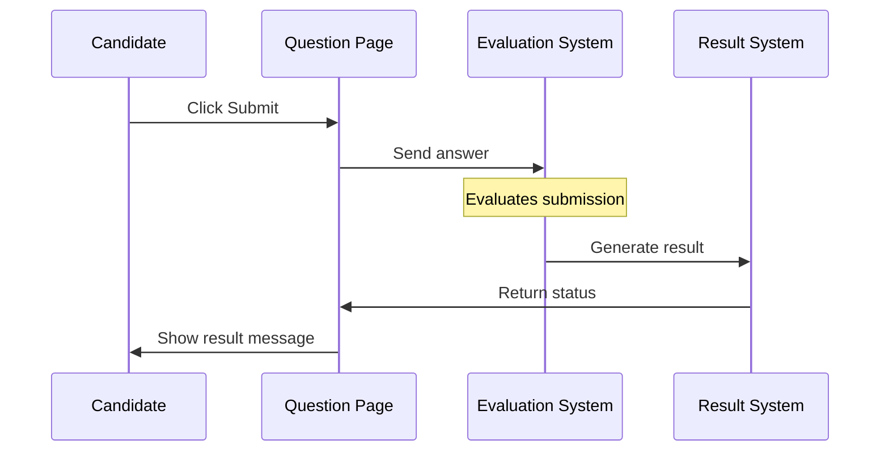

# Chapter 7: Submission Processing

In [Chapter 6: Monaco Editor Interaction](06_monaco_editor_interaction_.md), we learned how to work with the code editor for writing solutions. But what happens after you've written your answer? How does the system process your submission and give you feedback? This is where **Submission Processing** comes into play.

Think of Submission Processing as a postal system for your answers. You write a letter (your answer), put it in an envelope (the submission process), and the postal service delivers it and brings back a response (your results). This chapter will explore how this "postal system" works in our assessment platform.

## Why Do We Need Submission Processing?

Imagine you've just completed a programming challenge, but there's no way to submit your answer or see if it's correct. That would be frustrating! Submission Processing solves this problem by:

1. Providing methods to send your answers to the evaluation system
2. Handling the waiting period while your answer is evaluated
3. Interpreting the results and showing you if you succeeded

Without this system, there would be no way to complete your assessment or get feedback on your answers.

## Key Components of Submission Processing

Let's explore the main parts of the submission process:

### 1. Submitting Answers

Different question types have different submission methods, but they all start with clicking a submit button:

```python
def click_submit_code_monaco_editor(self):
    self.selenium_apis.scroll_to_element(self.SUBMIT_CODE_BUTTON_BLUE)
    self.selenium_apis.click_element(self.SUBMIT_CODE_BUTTON_BLUE, "xpath")
    self.log.info("submitted...")
```

This code finds and clicks the blue submit button for code questions. It's like dropping your letter in the mailbox - the first step in the submission journey.

### 2. Waiting for Evaluation

After submitting, your answer needs to be evaluated. This takes time, so we need to wait for the results:

```python
def wait_till_submission_is_evaluated(self):
    try:
        self.selenium_apis.wait_till_element_visible(self.SUBMISSION_EVALUATION_TEXT, "xpath")
        self.selenium_apis.wait_till_element_invisible(self.SUBMISSION_EVALUATION_TEXT, "xpath")
    except TimeoutException:
        self.log.warning("Submission evaluation text not found.")
```

This method waits for the evaluation to complete. It's like waiting for the mail carrier to deliver your letter and bring back a response.

### 3. Processing Results

Once evaluation is complete, we need to interpret the results:

```python
def _get_submission_result_using_regex(self, response_text: str) -> str:
    patterns = ["passed", "accepted", "wrong answer", "runtime error"]
    for pattern in patterns:
        if pattern in response_text.lower():
            return pattern
    return ""
```

This code scans the response text for patterns like "passed" or "wrong answer" to determine the outcome. It's like opening the return letter to see if your application was approved or rejected.

## A Practical Example: Submitting a Programming Answer

Let's walk through a complete submission process for a programming question:

```python
def submit_programming_solution():
    # Initialize the programming page
    programming_page = ProgrammingPage()
    
    # Submit our solution
    programming_page.click_submit_code_monaco_editor()
    
    # Wait for evaluation
    programming_page.wait_till_submission_is_evaluated()
    
    # Get and process the result
    result = programming_page.get_submission_result()
    
    return result
```

This example shows the complete flow: submitting a solution, waiting for evaluation, and getting the result. It's like sending an important document and anxiously waiting for the response.

## Different Question Types, Different Submissions

Each question type has its own submission process:

### Multiple Choice Questions

MCQs have a simpler submission process:

```python
def submit_mcq_with_random_answer(self) -> None:
    first_option_mcq = self.selenium_apis.get_element(self.FIRST_MCQ_OPTION_IN_QUESTION)
    first_option_mcq.click()
    self.selenium_apis.wait_till_element_visible(self.ANSWER_SAVED_CONFIRMATION)
    self.log.info("mcq ans saved successfully...")
```

This code selects the first option and waits for the "answer saved" confirmation. MCQs are automatically submitted when you select an option - like dropping a pre-addressed postcard in the mail.

### SQL Questions

SQL questions need to run the query and check the results:

```python
def results_of_execute_test_button_in_sql_submission(self):
    self.selenium_apis.click_element(self.EXECUTE_TEST_BUTTON, "xpath")
    self.wait_till_submission_is_evaluated()
    return self.get_submission_result_for_sql_and_approximate_questions()
```

This method clicks the "Execute & Test" button, waits for evaluation, and returns the result. It's like sending your query to a database and waiting for the response.

## How Submission Processing Works: Behind the Scenes

When you submit an answer, several components work together:



This diagram shows what happens when you submit an answer. Your submission goes through several steps before you see the final result.

### The Waiting Game

The most challenging part of submission processing is handling the waiting period:

```python
def wait_till_visible_testcase_is_evaluated(self):
    try:
        # Wait for evaluation text to appear
        self.selenium_apis.wait_till_element_visible(
            self.EVALUATING_TEXT_WHILE_RUNNING_VISIBLE_TESTCASES,
            "xpath",
            5,
        )
        # Wait for evaluation text to disappear
        self.selenium_apis.wait_till_element_invisible(
            self.EVALUATING_TEXT_WHILE_RUNNING_VISIBLE_TESTCASES,
            "xpath",
            200,
        )
    except TimeoutException:
        self.log.warning("Evaluation text not found.")
```

This method waits for the evaluation text to appear and then disappear, indicating the evaluation is complete. It's like watching for the mail truck to arrive and then leave after delivering your mail.

## Success and Failure: Interpreting Results

After submission, the system returns a result. Let's look at how we interpret different outcomes:

### Processing Success Messages

```python
def is_submission_accepted(self, result_text):
    return "accepted" in result_text.lower() or "passed" in result_text.lower()
```

This simple method checks if the submission was successful. It's like checking if your application was approved.

### Handling Errors

```python
def handle_submission_error(self, result_text):
    if "runtime error" in result_text.lower():
        # Handle runtime errors
        return "Your code has a runtime error. Check for exceptions."
    elif "wrong answer" in result_text.lower():
        # Handle incorrect answers
        return "Your answer is incorrect. Please review your solution."
```

This code interprets different error messages and provides helpful feedback. It's like understanding why your application was rejected so you can fix the issues.

## Real-World Example: Complete Submission Flow

Let's put it all together with a complete example of submitting a programming answer:

```python
def complete_submission_flow():
    # Initialize pages
    assessment_page = CandidateAssessmentPage()
    programming_page = assessment_page.programming_page
    
    # Navigate to the programming question
    assessment_page.open_nth_question_in_problems_flyout(2)
    
    # Write our solution (covered in Chapter 6)
    programming_page.enter_text_in_monaco_editor("solution.py")
    
    # Submit and process
    programming_page.click_submit_code_monaco_editor()
    programming_page.wait_till_submission_is_evaluated()
    
    # Get and handle the result
    result = programming_page.get_submission_result()
    
    if programming_page.is_submission_accepted(result):
        print("Success! Your solution was accepted.")
    else:
        print(f"Oops! There was a problem: {result}")
```

This example shows a complete submission flow from navigation to result handling. It combines the concepts from previous chapters with submission processing to provide a complete user experience.

## Advanced Submission Processing: All Submissions Tab

For some questions, you can view all your previous submissions:

```python
def view_all_submissions(self):
    self.click_on_all_submissions_tab()
    submission_count = self.get_submission_count()
    print(f"You have made {submission_count} submissions.")
```

This method opens the "All Submissions" tab and counts your attempts. It's like checking your mail history to see all the letters you've sent.

## Tips for Successful Submission Processing

Here are some practical tips for handling submissions effectively:

### 1. Always Wait for Evaluation

Always wait for the evaluation to complete before proceeding:

```python
def submit_and_wait(self):
    self.click_submit_code_monaco_editor()
    self.wait_till_submission_is_evaluated()  # Don't skip this!
    return self.get_submission_result()
```

Skipping the wait step might lead to incorrect results. It's like checking your mailbox before the mail carrier has arrived.

### 2. Handle Different Result Types

Be prepared to handle different result messages:

```python
def handle_all_result_types(self, result):
    if "accepted" in result:
        # Handle success
        pass
    elif "wrong answer" in result:
        # Handle wrong answer
        pass
    elif "runtime error" in result:
        # Handle runtime error
        pass
    else:
        # Handle unknown result
        pass
```

This pattern ensures you can respond appropriately to any result type. It's like being prepared for different responses to your application.

### 3. Check All Submissions for Progress

When working on difficult questions, check your submission history:

```python
def analyze_submission_history(self):
    self.click_on_all_submissions_tab()
    # Look at previous attempts to learn from mistakes
```

This helps you learn from previous attempts. It's like reviewing your past applications to improve future ones.

## The Connection to Specialized Question Pages

Submission processing relies heavily on the [Specialized Question Pages](03_specialized_question_pages_.md) we learned about earlier. Each question type has its own submission method:

- `MCQPage` handles selecting and submitting multiple-choice answers
- `ProgrammingPage` manages code submission and execution
- `SQLPage` handles database query evaluation

Each page type knows exactly how to submit its specific question type and process the results.

## Conclusion

Submission Processing is the vital bridge between answering a question and getting feedback. Like a postal system, it ensures your answers reach their destination and brings back the results. By understanding how submissions work, you can confidently navigate the assessment system and get accurate feedback on your answers.

This system builds on concepts from previous chapters, especially [Specialized Question Pages](03_specialized_question_pages_.md) and [Monaco Editor Interaction](06_monaco_editor_interaction_.md), to create a seamless experience from writing your answer to receiving your results.

In the next chapter, [Specialized Interfaces](08_specialized_interfaces_.md), we'll explore unique interfaces for specific assessment types that go beyond standard questions.

---

Generated by [AI Codebase Knowledge Builder](https://github.com/The-Pocket/Tutorial-Codebase-Knowledge)