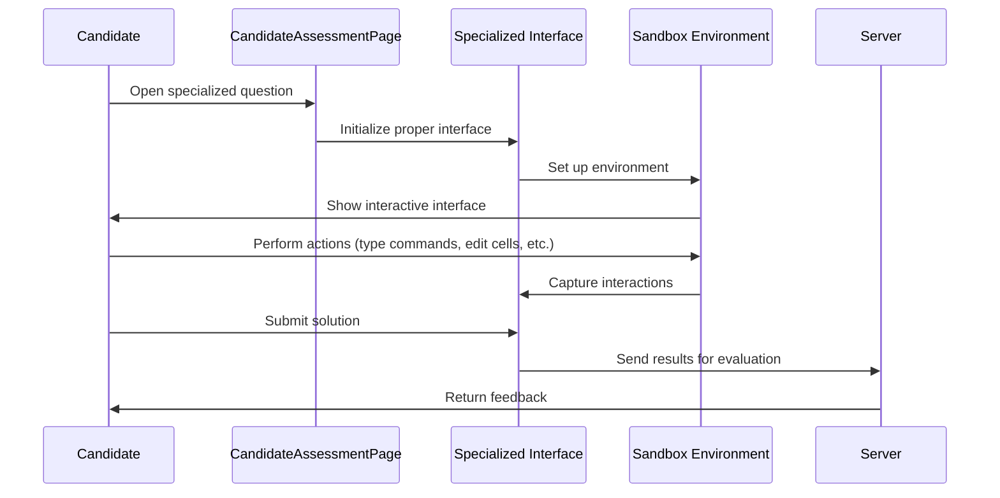

# Chapter 8: Specialized Interfaces

In [Chapter 7: Submission Processing](07_submission_processing_.md), we learned how answers are sent for evaluation and how results are processed. Now, let's explore how candidates interact with more complex question types that go beyond simple code editors and multiple-choice options.

## Introduction

Imagine you're trying to have a conversation with someone who speaks a rare, complex language. You'd need a specialized translator who understands both that language and yours to help you communicate effectively.

**Specialized Interfaces** work in a similar way. They are custom interaction methods designed for unique question types that require complex interactions, such as:

- DevOps terminals where you type shell commands
- Jupyter notebooks for data science tasks
- Diagram editors for creating visual solutions
- Interactive IDEs for fullstack development

These specialized interfaces bridge the gap between you and these complex question environments, allowing you to demonstrate your practical skills in realistic settings.

## Why Do We Need Specialized Interfaces?

Standard question types like multiple-choice or simple code editors use straightforward interfaces. But what happens when you need to:

- Run commands in a Linux terminal
- Create and run cells in a Jupyter notebook
- Draw a network architecture diagram
- Build and test a full web application

These tasks require specialized environments that can't be handled with simple text fields or code editors. Specialized Interfaces provide the tools needed to interact with these complex environments.

## Types of Specialized Interfaces

Let's explore the main types of specialized interfaces and how they work:

### 1. DevOps Terminal Interface

The DevOps Terminal interface allows you to interact with a Linux terminal right in your browser:

```python
def execute_command_in_terminal(self, command):
    self.selenium_apis.click_element(self.ENTER_CODE, "xpath")
    self.selenium_apis.element_send_keys(self.ENTER_CODE, "xpath", command)
```

This method lets you type a command into the terminal. It's like having a real shell where you can run Linux commands to solve DevOps challenges.

### 2. Data Science Notebook Interface

For data science questions, a Jupyter-like notebook interface is provided:

```python
def type_in_notebook_cell(self, code_filename, directory, cell_number=1):
    self.selenium_apis.click_element(
        self.DYNAMIC_NOTEBOOK_CELL_INPUT_AREA.format(cell_number), "xpath"
    )
    elem = self.selenium_apis.get_element(self.CODE_TEXTAREA, "xpath")
    # Read and enter code
```

This method lets you write code in a specific cell of a Jupyter notebook. You can then run the cell and see the output, just like in a real data science environment.

### 3. Diagram Editor Interface

Some questions ask you to create diagrams, such as system architecture or database schemas:

```python
def search_and_select_component(self, text_to_search="aws"):
    self.selenium_apis.element_send_keys(self.SEARCH_OPTION, "xpath", text_to_search)
    self.selenium_apis.click_element(self.SELECT_COMPONENT, "xpath")
    # Returns element counts before and after
```

This method helps you search for and add components to your diagram. It's like using a simplified version of drawing tools like Visio or Lucidchart right in your assessment.

### 4. Fullstack IDE Interface

For fullstack development questions, a complete IDE (Integrated Development Environment) is provided:

```python
def scroll_to_ide_and_open(self):
    self.selenium_apis.click_element(self.LOAD_IDE_BUTTON, "xpath")
    # Wait for IDE to load
    self.selenium_apis.click_element(self.EDIT_IN_IDE_BLUE_BUTTON, "xpath")
    # IDE is now ready to use
```

This method opens a full-featured IDE where you can edit multiple files, run code, and see the output of your web application. It's like having VS Code or similar editors right in your assessment.

## A Practical Example: Using the DevOps Terminal

Let's walk through a practical example of using the DevOps Terminal interface:

```python
def solve_devops_question():
    # Get instances of needed pages
    assessment_page = CandidateAssessmentPage()
    devops_page = assessment_page.devops_page
    
    # Open the DevOps question
    assessment_page.open_nth_question_in_problems_flyout(4)
    
    # Switch to the terminal iframe
    devops_page.switch_to_devops_terminal_iframe()
    
    # Run commands in the terminal
    devops_page.execute_command_in_terminal("ls -la")
    devops_page.execute_command_in_terminal("mkdir test_dir")
    
    # Submit the answer
    devops_page.exit_terminal_iframe()
    devops_page.click_submit_button()
```

This example shows how to solve a DevOps question: open the question, switch to the terminal interface, run some Linux commands, then submit your answer. The specialized DevOps interface handles all the complexities of working with a terminal.

## How Specialized Interfaces Work: Behind the Scenes

When you interact with specialized interfaces, several components work together:



This diagram shows the flow of information when using specialized interfaces. The CandidateAssessmentPage determines which specialized interface to use, which then sets up the appropriate environment and handles your interactions.

## Detailed Look: Data Science Notebook Interface

Let's examine the Data Science Notebook interface in more detail:

### Setting Up the Notebook

First, the interface needs to be properly set up:

```python
def choose_interface_in_setup_editor_modal(self, interface):
    # Select either "script" or "notebook"
    if interface == "script":
        xpath_for_interface = self.SCRIPT_OPTION_IN_SETUP_YOUR_EDITOR_MODAL
    else:
        xpath_for_interface = self.NOTEBOOK_OPTION_IN_SETUP_YOUR_EDITOR_MODAL
    
    self.selenium_apis.click_element_js(xpath_for_interface, "xpath")
```

This method lets you choose between a simple script editor or a Jupyter notebook interface. For data science questions, the notebook interface provides a more realistic environment.

### Working with Notebook Cells

Once the notebook is loaded, you can work with cells:

```python
def run_selected_cell_with(self, action_type="button"):
    if action_type == "button":
        self.selenium_apis.click_element(self.RUN_NOTEBOOK_BUTTON, "xpath")
    elif action_type == "shortcut":
        elem = self.selenium_apis.get_element(self.CODE_TEXTAREA, "xpath")
        elem.send_keys(Keys.SHIFT + Keys.ENTER)
```

This method runs a cell in the notebook, either by clicking the run button or using the keyboard shortcut (Shift+Enter). It's just like working in a real Jupyter notebook!

### Waiting for Cell Execution

After running a cell, you need to wait for execution to complete:

```python
def wait_till_evaluation_is_complete_for_cell_number(self, cell_number):
    # Wait for the running indicator to disappear
    self.selenium_apis.wait_till_element_invisible(
        self.DYNAMIC_NOTEBOOK_CELL_RUNNING_STATUS.format(cell_number),
        "xpath"
    )
```

This method waits until the cell finishes executing. In a notebook, cells show an asterisk (*) or similar indicator while running, which disappears when execution is complete.

## Detailed Look: Diagram Editor Interface

The Diagram Editor interface provides methods for creating visual diagrams:

```python
def click_on_edit_diagram_option(self):
    self.selenium_apis.click_element(self.EDIT_DIAGRAM_OPTION, "xpath")
```

This simple method opens the diagram editor. Once open, you can add components, connect them, and create your visual solution.

```python
def enter_additional_comments(self, comment="sample"):
    self.selenium_apis.element_send_keys(self.ADDITIONAL_COMMENTS, "xpath", comment)
```

After creating your diagram, you can add explanatory comments to describe your solution.

## Detailed Look: DevOps Terminal Interface

For DevOps questions, the terminal interface is crucial:

```python
def wait_till_terminal_is_loaded(self):
    self.selenium_apis.wait_till_element_invisible(
        self.PLACEHOLDER_IMAGE_FOR_DEVOPS_TERMINAL,
        "xpath",
        wait_time=240,
    )
```

This method waits for the terminal to fully load. DevOps terminals can take time to initialize, as they're often connecting to actual cloud environments.

```python
def execute_and_wait_till_all_commands_are_done_in_terminal_from_file(
    self, text_file, wait_time_for_each_command=1
):
    code_contents = self.selenium_apis.read_text_file(text_file)
    for line in code_contents:
        # Enter the command
        self.selenium_apis.element_send_keys(self.ENTER_CODE, "xpath", line.strip())
        # Wait for prompt to return
```

This more complex method runs a series of commands from a file, waiting for each to complete. It's like having a script to automatically run commands in a terminal.

## Creating Your Own Specialized Interface Interactions

When working with specialized interfaces, you'll often create custom workflows. Here's an example for a data science question:

```python
def solve_data_science_question():
    # Initialize pages
    assessment_page = CandidateAssessmentPage()
    ds_page = assessment_page.data_science_page
    
    # Open the data science question
    assessment_page.open_nth_question_in_problems_flyout(3)
    
    # Choose notebook interface
    ds_page.click_edit_project_code_button()
    ds_page.choose_interface_in_setup_editor_modal("notebook")
    ds_page.click_proceed_button_in_setup_editor_modal()
    
    # Wait for notebook to load
    ds_page.wait_for_jupyter_to_load()
    
    # Write and run code in the first cell
    ds_page.type_in_notebook_cell("solution.py", cell_number=1)
    ds_page.run_selected_cell_with("button")
    
    # Submit the solution
    ds_page.switch_to_jupyter_iframe()
    ds_page.click_save_notebook_button()
    ds_page.exit_terminal_iframe()
    ds_page.click_submit_code_monaco_editor()
```

This example shows a complete workflow for solving a data science question using the Jupyter notebook interface.

## The Connection to Other Components

Specialized interfaces build on concepts from earlier chapters:

1. They're initialized by the [CandidateAssessmentPage](01_candidateassessmentpage_.md) based on question type
2. They inherit common functionality from [QuestionsBase](02_questionsbase_.md)
3. They're implemented as [Specialized Question Pages](03_specialized_question_pages_.md)
4. They use [Submission Processing](07_submission_processing_.md) to evaluate answers

This layered architecture allows each specialized interface to focus on its unique requirements while leveraging common functionality.

## Tips for Working with Specialized Interfaces

Here are some practical tips for working with specialized interfaces:

### 1. Be Patient During Loading

Specialized environments often take time to initialize:

```python
def wait_for_environment(specialized_page):
    # DevOps terminals may take up to 4 minutes to load
    if isinstance(specialized_page, DevopsPage):
        specialized_page.wait_till_terminal_is_loaded()
    # Jupyter notebooks may take 1-2 minutes
    elif isinstance(specialized_page, DataSciencePage):
        specialized_page.wait_for_jupyter_to_load()
```

Always wait for the environment to fully load before attempting to interact with it.

### 2. Save Your Work Frequently

In complex environments, it's important to save your progress:

```python
def save_work_periodically(specialized_page):
    # For notebooks, save after significant changes
    if isinstance(specialized_page, DataSciencePage):
        specialized_page.click_save_notebook_button()
    # For diagrams, save after adding components
    elif isinstance(specialized_page, DiagramPage):
        specialized_page.click_on_save_diagram_option()
```

Regular saving prevents losing your work if there are connectivity issues.

### 3. Test Before Submitting

Always test your solution before final submission:

```python
def test_before_submit(specialized_page):
    # For DevOps, check if commands worked as expected
    if isinstance(specialized_page, DevopsPage):
        specialized_page.execute_command_in_terminal("ls -la")
    # For fullstack, test if the application runs correctly
    elif isinstance(specialized_page, FullstackPage):
        specialized_page.is_theia_preview_working()
```

Testing helps ensure your solution works correctly before you submit it for evaluation.

## Conclusion

Specialized Interfaces act as translators between you and complex question environments, allowing you to demonstrate practical skills in realistic settings. Whether you're working with terminals, notebooks, diagrams, or fullstack applications, these interfaces provide the tools you need to interact effectively.

By understanding how to use these specialized interfaces, you can confidently tackle a wide range of question types in your assessments, showing not just theoretical knowledge but practical skills in action.

In this chapter, we've explored different types of specialized interfaces and how they work behind the scenes. We've seen practical examples of using these interfaces and learned tips for working with them effectively.

As assessment platforms continue to evolve, specialized interfaces will become increasingly important, enabling more realistic and hands-on evaluation of technical skills in a browser-based environment.

---

Generated by [AI Codebase Knowledge Builder](https://github.com/The-Pocket/Tutorial-Codebase-Knowledge)