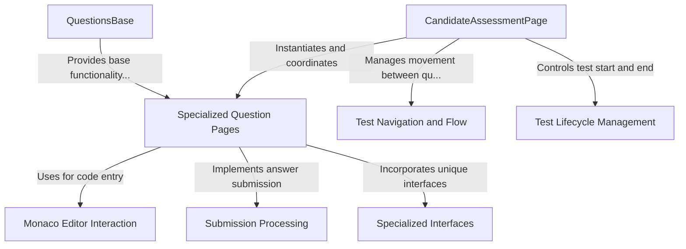

# Tutorial: candidate_interface

The `candidate_interface` project provides an **automated testing framework** for interacting with online technical assessments. It allows testers to simulate candidate actions like answering questions, submitting code, and navigating through tests. The framework is built around a hierarchical structure where `QuestionsBase` provides common functionality that specialized question handlers inherit, while the `CandidateAssessmentPage` orchestrates the overall test flow from login to submission. This design enables *consistent interaction* with diverse question types (MCQ, programming, SQL, etc.) through a unified interface.

**Source Repository:** [None](None)

## Chapters

1. [CandidateAssessmentPage
](01_candidateassessmentpage_.md)
2. [QuestionsBase
](02_questionsbase_.md)
3. [Specialized Question Pages
](03_specialized_question_pages_.md)
4. [Test Lifecycle Management
](04_test_lifecycle_management_.md)
5. [Test Navigation and Flow
](05_test_navigation_and_flow_.md)
6. [Monaco Editor Interaction
](06_monaco_editor_interaction_.md)
7. [Submission Processing
](07_submission_processing_.md)
8. [Specialized Interfaces
](08_specialized_interfaces_.md)

---

Generated by [AI Codebase Knowledge Builder](https://github.com/The-Pocket/Tutorial-Codebase-Knowledge)